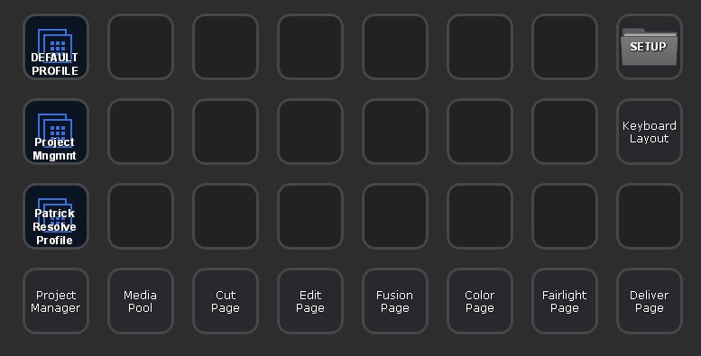

# StreamDeck_Profile_Warehouse
As members of the community of Colorists (and editors, motion graphic designers, etc) at [mixinglight.com](http:\\mixinglight.com), we were discussing ways to share layouts for our individual SteamDeck Profiles. I thought of using a GitHub repository as a way to keep tabs on versions and allow for updates or tweaks. You can submit your own Stream Deck profiles here. Or, if you'd like, you can submit a set of Icons for others to use as button labels in their Stream Deck setups. Icons should be 288x288 PNG files.

Browse the submissions in the PROFILES or ICONS folder and see what others are doing. Share your setups and collaborate with others to improve your workflows.

To make a submission, follow the instructions below and then submit an "Issue" using the link above.

### To Make a Submission
To submit a set of profile files, you need to follow these steps:

1A. If you are just submitting a set of Icons, put them in a folder along with a README.md file (with image links as described in Step 3 below. Skip #1B & #2). If you are including them in your Profile Submisson, place them inside an ICON subfolder along with your other assets.

1B. Export the Stream Deck Profile you'd like to share with the world. Use the "Export" function from the Profiles window of the Stream Deck Control Panel.

2. Grab a simple screen shot of the same panel from within the Stream Deck Control Panel.

If you have nested folders, it would nice to make screen grabs of those as well.

3. Write up a little explanation in a simple text file named "README.md". You can reference images in your README by typing this for each image:

``

4. Place everything in a folder & ZIP it.

5. To make a submission, click on 'Issues' above and create a new issue.

Take a look at how the [Example Profile](PROFILES/_EXAMPLE-PROFILE) is laid out and mimic that for yours. (You don't need to include the ZIP file inside itself, of course.)

Thanks,
Ben Howard (ben@buttonpusher.tv)
Visit my [buttonpusherKB](https://github.com/buttonpushertv/buttonpusherKB) repo for a whole 'nother level of cusomizing your system or for ideas on what you _could_ do with a little work.